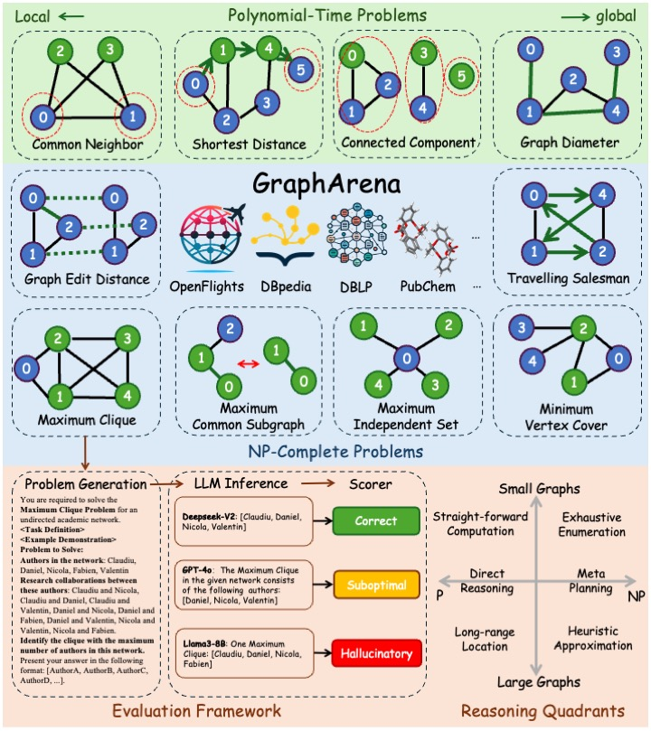

# GraphArena Benchmark

This repository contains the codebase for the following manuscript:

> **GraphArena: Benchmarking Large Language Models on Graph Computational Problems**  
> *Authors: Jianheng Tang, Qifan Zhang, Yuhan Li, Jia Li*  



## Environment Setup

To set up the required environment, please follow the steps below:

```bash
conda create -n GraphArena
source activate GraphArena
conda install openai pandas numpy networkx pip
pip install pybind11
pip install rdkit ogb graph-walker
```

## Dataset Preparation

The dataset `dataset.zip` for benchmarking can be downloaded and unzipped directly from our [Google Drive](https://drive.google.com/drive/folders/1mvJSUTrfOX13wgpkyb3w8s_SJqipnb1c?usp=sharing) or [OneDrive](https://hkustconnect-my.sharepoint.com/:f:/g/personal/jtangbf_connect_ust_hk/EtMw1C3z82ZCgyhinWnZR7UBWhdvK5LYBPWOQhWx9lAvjg?e=VzvrSH).

For those who prefer to prepare the dataset from scratch, download `source.zip`, unzip it, and execute the script `run_dataset.sh`.

## LLM Inference

Call LLM API using the command below:

```bash
python benchmark_LLM_api.py --task $task --problem_num $problem_num --example_num $example_num --results $results --llm $llm --difficulty $difficulty --resume $resume --sleep $sleep
```

For example, running GPT on the TSP task with small graphs and 500 problems:

```bash
python benchmark_LLM_api.py --task TSP --problem_num 500 --llm gpt --difficulty easy
```

If you want to evaluate LLMs locally, using the command below:

```bash
python benchmark_LLM_local.py --llm llama8b/GraphWiz
```

For comprehensive benchmarking across all tasks, run `run_benchmark.sh`. Details about command-line arguments are available in both `benchmark_LLM.py` and `run_benchmark.sh`.

Supported LLM models:

```json
{
    "gpt4": "gpt-4o",
    "gpt": "gpt-3.5-turbo-0125",
    "claude": "claude-3-haiku-20240307",
    "mixtral": "mistralai/Mixtral-8x7B-Instruct-v0.1",
    "deepseek": "deepseek-chat",
    "llama8b": "meta-llama/Llama-3-8b-chat-hf",
    "llama": "meta-llama/Llama-3-70b-chat-hf",
    "qwen7b": "qwen1.5-7b-chat",
    "qwen": "qwen1.5-72b-chat",
    "gemma": "gemma-7b-it"
}
```

## Reproducing Evaluation Results

To reproduce the results presented in our manuscript, please follow these steps:

1. Unzip `final_results.zip`.
2. Run the following scripts in sequence:
- `reproduce_table1.ipynb`
- `reproduce_figure2.py`
- `reproduce_figure3.py`
- `reproduce_figure4.py`

Please note that the plotting process may take a few minutes to complete.

### Case Demonstration

The full dataset of problems and corresponding LLM responses is available in `final_results/GraphArena_all.json`. This JSON file organizes the data as follows:

```
{
    "Task_name": [
        {
            "id": 0,  // IDs range from 0-499 for small graphs (easy) to 500-999 for large graphs (hard)
            "problem_text": "...",
            "LLM responses": "..."
        },
        ...
    ]
}
```

For more human-readable examples, please refer to `examples.md`.

## Licensing

The dataset is available under the CC BY-SA 4.0 License. The code repository is licensed under the BSD-2 Clause.

## Long-term Preservation

This repository is maintained by Jianheng Tang (sqrt3tjh@gmail.com). For long-term support and updates, Qifan Zhang (bklight999@gmail.com) and Yuhan Li (yuhanli@mail.nankai.edu.cn) are also key maintainers.